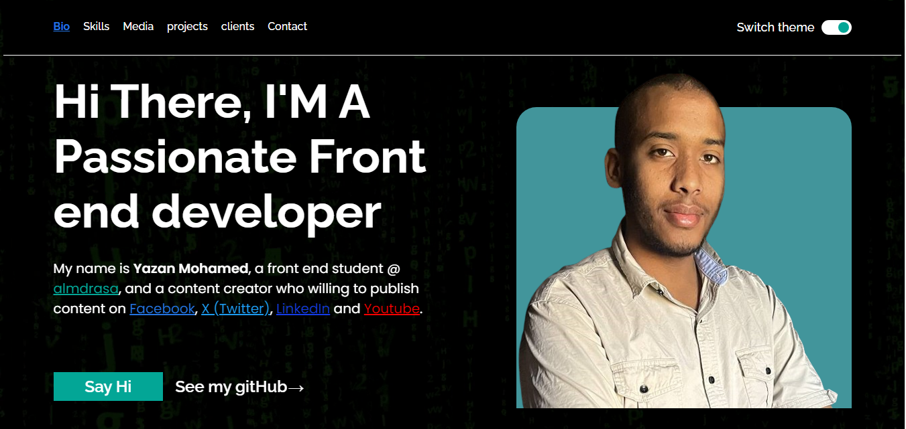

# Portfolio Project

Welcome to this personal portfolio project! This project showcases my skills and projects using HTML, CSS, and Sass.

## Table of Contents

- [Overview](#overview)
- [Features](#features)
- [Demo](#demo)
- [Built With](#built-with)
- [Contributing](#contributing)
- [Acknowledgments](#acknowledgments)

## Overview

This portfolio project is a representation of my skills, projects, and achievements. It's designed to provide an interactive and visually appealing showcase of my work. The project is built using HTML to structure the content, CSS for styling, and Sass for a more maintainable and organized stylesheet.

## Features

- Responsive design for various screen sizes.
- Sass for better maintainablity.
- Sections for showcasing projects, skills, and a brief bio.
- Easy navigation with smooth scrolling.

## Demo

[View the live demo](https://yazan1mohamed.github.io/html-css-portfolio/#bio) .

 -.

## Built With

- HTML
- CSS
- Sass - [Sass Documentation](https://sass-lang.com/documentation)

## Contributing

Contributions are welcome! If you find any issues or have suggestions for improvement, please open an issue or submit a pull request.

## Acknowledgments

- Special thanks to Mohamed Abusrea for guidance.
